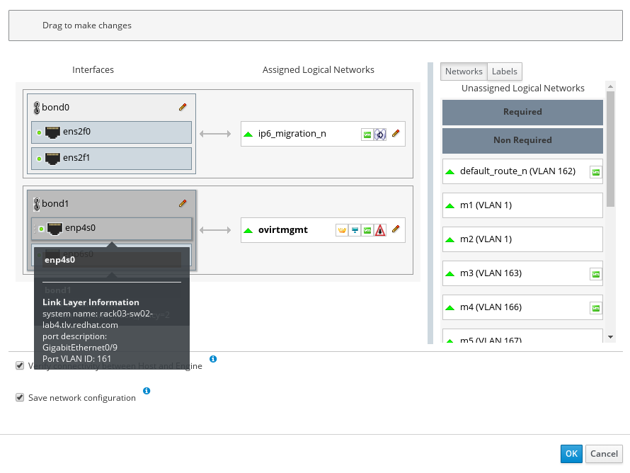
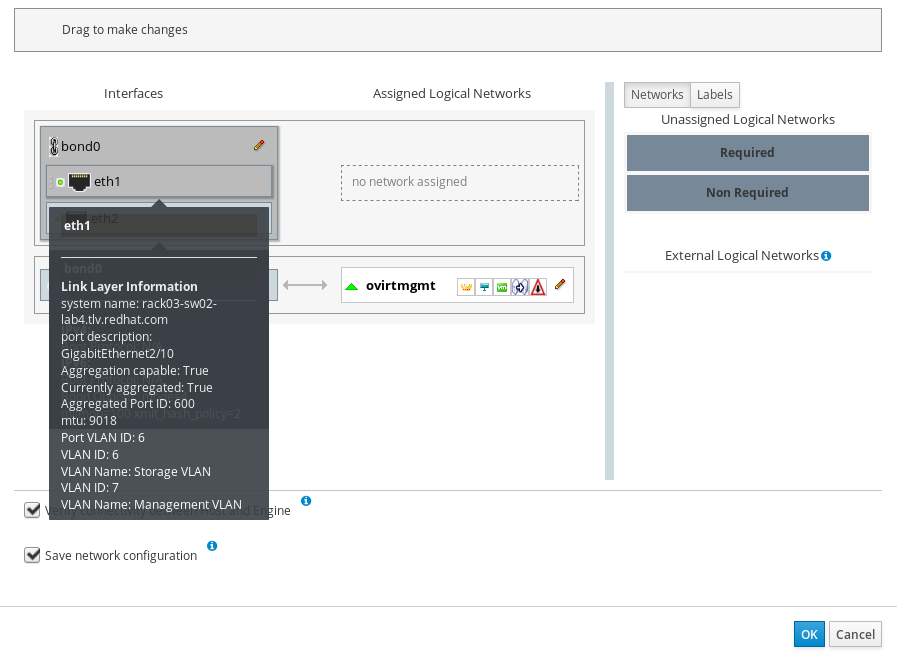

In oVirt 4.2 we have introduced support for LLDP protocol. 
LLDP stands for Link Layer Discovery Protocol, which is used by network devices 
for advertising identity and capabilities to neighbors on a LAN. 
[More information about LLDP](https://learningnetwork.cisco.com/docs/DOC-26851).

READMORE

## Useful information

The information gathered by the protocol can be used for better network 
configuration. UI shows most important informations e.g. System name, Port 
description and VLAN IDs.

When adding a host into oVirt cluster, the administrator usually needs to attach
various networks to it. However, a modern host can have multiple interfaces each 
with its non-descriptive name e.g. image below. The administrator has to know 
to which interface he should attach network named `m2` with VLAN_ID 162. 
Should it be interface `np4s0`, `ens2f0` or even `ens2f1`? With 
oVirt 4.2, the administrator can hover over `enp4s0` and see that this 
interface is connected to peer switch `rack01-sw03-lab4`, and see that this 
peer switch does not support VLAN 162 on this interface. By looking at every 
interface, administrator can choose which interface is the right one for network
`m2`.
 

Similar situation is configuration of bond with mode 4 (LACP). It is very 
important, to understand to which port of peer switch is each interface 
connected to. When creating `bond0` in the images below, it is important to 
pick interfaces that are connected to ports of the same peer switch, and that 
these ports are in the same `port group`. It happens quite often, that 
an administrator chooses wrong interfaces, and end up with badly configured bonds. 
With LLDP information this can be easily avoided. The administrator can choose 
interfaces based on their peer switch and port name. E.g. `enp4s0` is 
connected to port `GigabitEthernet0/9` and `enp6s0` is connected to port
`GigabitEthernet0/10` on the same peer switch with name `rack03-sw02-lab4`. 

The last screenshot below show every information available to the administrator via
UI. System name, Port description, Aggregation information,MTU , VLAN IDs and names.

## Where to find this information

In the **Administration Portal**. From the vertical menu select **Compute** > 
**Hosts** and click on **Link (Name)** of your desired host. Then select 
**Network Interfaces** > **Setup Host Networks**. By hovering over interfaces, 
the appropriate tooltip will show with its information. 

### Non-UI approach

The LLDP information is also exposed via REST API. 
More information is available in [REST API documentation](http://ovirt.github.io/ovirt-engine-api-model/4.2/#services/link_layer_discovery_protocol).

